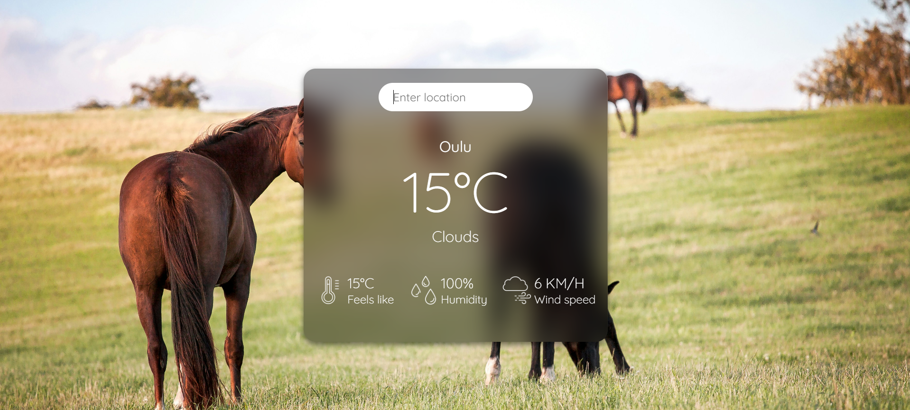
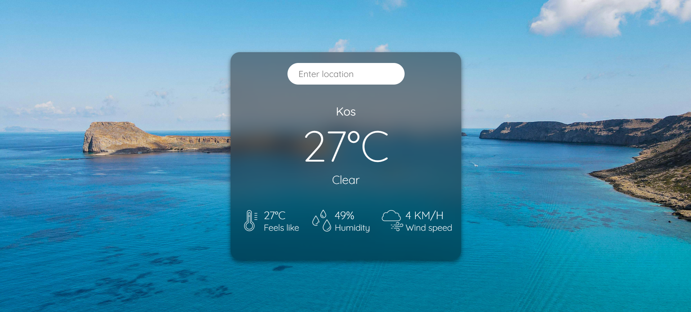
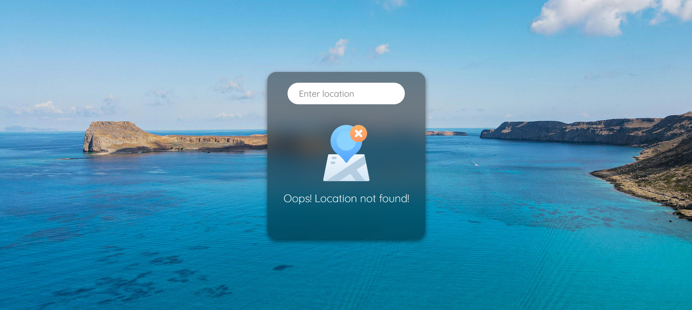

# WeatherApp

### Overview

This __Weather App__ is a simple, React-based application that allows users to view the current weather of any location worldwide. By entering a city name, the app fetches real-time weather data using the OpenWeatherMap API and displays information like temperature, weather description, "feels like" temperature, humidity and wind speed. Additionally, the app dynamically changes its background depending on the temperature and displays an error message when the location is invalid.

### Features

* __Real-time weather data__: Fetches up-to-date weather information using the OpenWeatherMap API.
* __Dynamic backgrounds__: The background image changes based on the temperature:
⋅⋅⋅Cold background for temperatures ≤ 10°C.⋅⋅
⋅⋅⋅Warm background for temperatures between 11°C and 20°C.⋅⋅
⋅⋅⋅Hot background for temperatures ≥ 21°C.⋅⋅
* __Slide-in animations__: The weather information smoothly slides in after the first search and also on subsequent searches
* __Weather details__: Displays temperature, weather description, "feels like" temperature, humidity, and wind speed.
* __Error handling__: If the location is not found, a custom error message is shown.

### Technologies used

* __React__: For building the user interface.
* __Axios__: For making API requests to the OpenWeatherMap API.
* __CSS transitions__: For animations like sliding in the weather info.
* __OpenWeatherMap API__: For retrieving real-time weather data.

### Pictures

How the app looks:

*Initial view of the Weather App before any city is searched.*

*Weather details displayed after searching for a city.*

*Updated weather information after searching for a different city.*

*Error message displayed when the entered city is not found.*

### Installation and setup

#### Prerequisites

* Node.js (version >= 14.x)
* npm (version >= 6.x)

#### Setup

1. Clone the repository.
2. Install the necessary dependencies using npm install.
3. Get an API key from [https://openweathermap.org/].
4. Create a .env file in the root of the project and add your API key.
5. Once you have the API key set, start the React development server using npm start.

The app should now be running at http://localhost:3000/.

### How to use

1. Open the app in your browser.
2. Enter a city name in the search bar and press Enter.
3. The app will display the current temperature, weather description, "feels like" temperature, humidity, and wind speed.
4. If the city is not found, an error message will appear to inform you of the issue.

### Future improvements and development ideas

* __Hourly/Weekly forecasts__: Extend the app to show more detailed forecasts.
* __Unit conversion__: Add the ability to toggle between Celsius and Fahrenheit.
* __Better error message__: I'm not happy with the error message, I would like it to appear more smoother.
